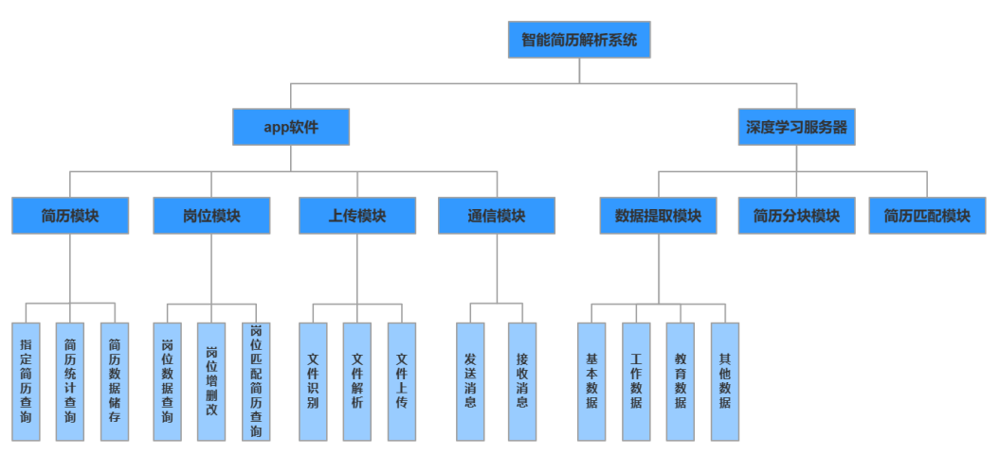
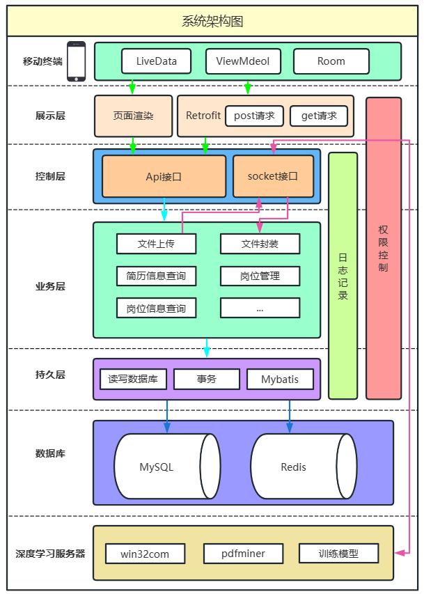
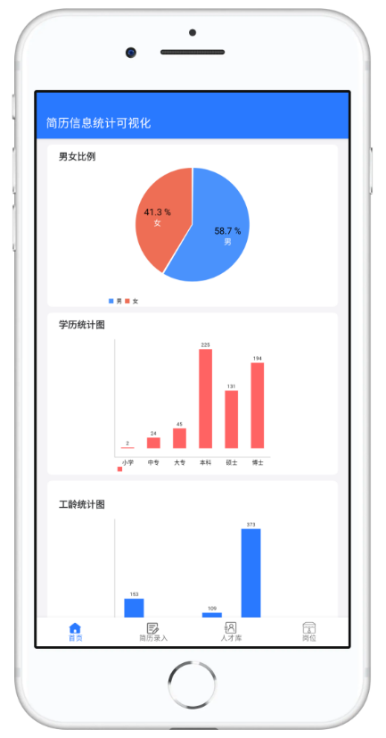
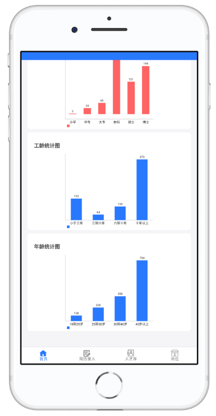

# Judy简历解析系统

> 基于SpringBoot+Redis+Android+深度学习模型的智能简历分析与岗位匹配系统

### 项目背景

该项目的灵感主要来源于中国软件杯发布的赛题；从赛题的介绍上，我们了解到智能简历分析软件的真实业务背景主要涉及优化和改善企业的招聘流程。通过智能简历分析软件，企业能够根据简历信息和岗位要求，有效地评估求职者的实际能力，并实现合理的岗位匹配，从而降低人力成本并提升招聘效率。这种软件的引入帮助企业快速筛选和评估大量的简历，减少人工操作和主观判断的误差，同时提供准确的数据分析和报告，为决策者提供更全面的招聘参考。通过智能简历分析软件，企业能够更加高效地招聘合适的人才，提升整体招聘流程的效率和质量。

### 项目技术栈和特点 

#### 后端

| 库名        | 作用                    |
| --------------------- | --------------------------------- |
| Springboot  | 简化Spring应用程序的配置和部署    |
| MybatisPlus | MyBatis基础上的增强工具，简化开发 |
| Redis       | 用于缓存数据                      |
| Mybatis     | 简化数据库操作的流程              |
| docker      | 简化应用程序的部署和运维          |
| lombok      | 减少重复的代码编写                |
| iText       | 生成和处理PDF文档                 |
| knife4j     | 便于生成API文档                   |
| hutool      | 提供丰富的常用工具类              |
| huaweicloud | 连接obs对象云存储                 |
| websocket   | 实现实时的双向通信                |
| commons-io  | 处理IO操作的工具库                |

#### 前端——安卓

| 库名                         | 作用       |
| ---------------------------- | -------------------- |
| Retrofit          | 网络       |
| Navigation         | 路由       |
| Fragment           | 页面碎片化 |
| LiveData+ViewModel | 数据       |

#### 深度学习

| **库名**         | **作用**         |
| ---------------- | ---------------- |
| **numpy**        | 用于数组快速操作 |
| **pandas**       | 数据分析处理工具 |
| **jieba**        | 中文分词库       |
| **torch**        | 深度学习框架     |
| **torchcrf**     | 用于crf层        |
| **transformers** | 深度学习框架     |
| **paddle**       | 深度学习框架     |
| **pdfminer**     | 解析简历         |
| **datetime**     | 处理时间数据     |
| **re**           | 正则表达式工具库 |
| **docx2pdf**     | 文件格式转化     |
| **Python_SDK**   | 移动云OCR识别    |

### 项目功能

（一）简历信息和岗位信息录入功能：能够上传文本、PDF、DOCX格式和图片格式（如JPEG/PNG）的简历文件，并能够手动输入和编辑简历信息和岗位信息。

（二）简历分析功能：能够自动提取简历中的关键信息。包括姓名、年龄、最高学历、毕业院校和工作年限等维度的信息。

（三）简历信息统计和展示功能：简历信息的统计可视化和单一简历的分析可视化功能。用户可以查看简历信息的汇总和统计，例如不同学历、工作年限的分布等。用户还可以查看单一简历的分析结果，以更详细地了解求职者的背景和能力。

（四）人才画像构建功能：软件可以支持人才画像功能。用户可以将这些标签与简历相关联，以便更好地理解和评估求职者的特点和能力。

（五）人岗匹配功能：软件可以根据不同岗位的需求，对求职者进行排序和匹配。根据不同的优先级和条件，软件可以帮助用户找到最适合的候选人。 

### 项目结构图

### 系统架构图

### 数据库库表设计

### 页面设计

#### 首页

简历信息统计可视化版图

#### 人才库页面

查看所有已经录入的简历基本信息，包括姓名、年龄、最高学历、毕业院校、工作年限这5个要素。  

#### 详情页

简历详情页面能够清晰地看到这份简历的所有消息，包括工作经历，教育经历和雷达图等信息。

#### 导入页面

根据不同支持的导入类型，选择需要的类型进行信息导入，本软件支持上传文本、PDF、DOCX格式和图片格式（如JPEG/PNG）的简历文件

#### 岗位页面

查看企业需要招聘的岗位消息

点击具体的岗位，可以查看此岗位详细信息，包括岗位名称，岗位职责，岗位要求，下方有此岗位所匹配的人选信息。在筛选栏中，可以根据不同的需求对简历进行排序，可以选择工龄优先，学历优先，年龄优先这三种排序方式

